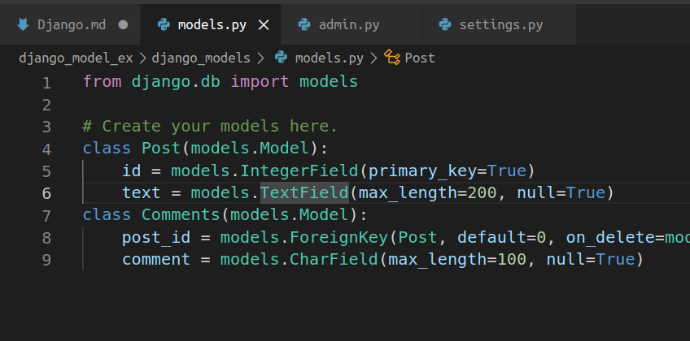

Models.py

## on_delete CASCADE

Cascade emulates the SQL constraint of ON DELETE CASCADE. Whenever the referenced object (post) is deleted, the objects referencing it (comments) are deleted as well. This behaviour is a reasonable default and makes sense for most relationships — for this one as well.

Let's see in this example what on_delete cascade do:
- I had created two models post and comments. Here post_id is foreign key for comments model refering to id of post model. Also the on_delete is set to CASCADE.  

- Now here are those two tables of Post & Comments I had already added some datas in these tables.  

- Since the on_delete is set to CASCADE, if we delete the data from Post, the data on Comments referencing to data on Post is also deleted.  

Apart from CASCADE we also have the following options:
- PROTECT: This prevents referenced onjects from being deleted if it already has an object referencing it in the database. Put simply, Django will prevent a post from deletion if it already has comments.
- SET_NULL: THis option is only available when we have set the null option on foreignkey field set to True. When we use this option, and delete a post, it is going to leave the comments in the database without deleting it.
- SET_DEFAULT: This requires a default value. When we delete a post comments are automatically assigned to default post we had set.
- SET: This is similar to SET_DEFAULT, but it also allows us to set value of foreign key to value passed in SET, or a callable we have defined and passed to it as an argument.
- DO_NOTHING: As the name implies it does nothing when a referenced object is deleted. Our comments are still referencing posts that do not exist, causing data integrity errors.

## Fields & Validators
The most important part of a model and the only required part of a model is the list of database fields it defines. Fields are specified by class attributes. Fields in Django are the data types to store a particular type of data. For example, to store an integer, IntegerField would be used.

Dango comes with various fields types some of the most commonly used are:
- __CharField__: A field to store text-based values.
- __DateTimeField__: It is used for date and time, represented in Python by a datetime.datetime instance.
- __IntegerField__: It is an integer field. Values from -2147483648 to 2147483647 are safe in all databases supported by Django.
- __TextField__: A large text field. The default form widget for this field is a Textarea.
- __ForeignKey__: A many-to-one relationship. Requires two positional arguments: the class to which the model is related and the on_delete option.

## Validators
Validator is a callable that takes a value and raises ValidationError, if doesnt meet certain requirements.

Let's see an example:
- I had created a model, Email check which validate @gmail IDs only.
  
- I had created validate_email function which will check if the mail is @gmail.com or not otherwise it will raise error.
- We can implement validator by providing validators argument.
  
  
There are some builtin validators too, like URLvalidator, RegexValidator,validate_email etc.

## Difference between Python module and Python classes

Modules:
Modules in Python are files with a .py extension using which we can reuse elements inside that file. When we create a python program, the program may contain inside it functions, variables, and even classes.
If we want to reuse the same piece of function code or the same class, we can import that entire file as a module into another program.

Class:
Classes in python act as a blueprint based on which objects are created. A class is a user-defined blueprint or prototype from which objects are created. Classes provide a means of bundling data and functionality together. Creating a new class creates a new type of object, allowing new instances of that type to be made. Each class instance can have attributes attached to it for maintaining its state. Class instances can also have methods (defined by their class) for modifying their state.

Reference:
[on_delete](https://medium.com/@inem.patrick/django-database-integrity-foreignkey-on-delete-option-db7d160762e4)